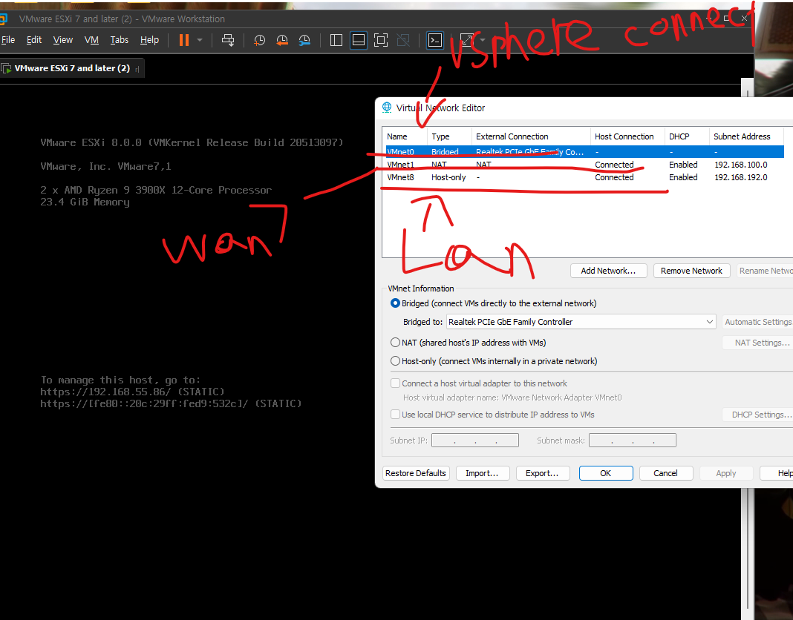

# 만약 WAN이 다른 웹서버에 접속이 안된다면 반드시 따라하자

WAN이 다른 웹서버인 GOOGLE, naver, 이런곳에 접속이 안된다면은 체크를 해주자.

1. vmware와 ESXI의 설정이 의도했던 대로 흘러갔는가?

2. ESXI와 PFSENSE의 MAC주소가 다르지 않는가?

3. NIC을 다른걸 연결한건가?
    * VM에서 nic부분을 verbose하기

4. 게이트웨이가 잘 적용됐는가?
    * route -n 으로 확인

# 여담
이거떄문에 10시간정도 고생함 