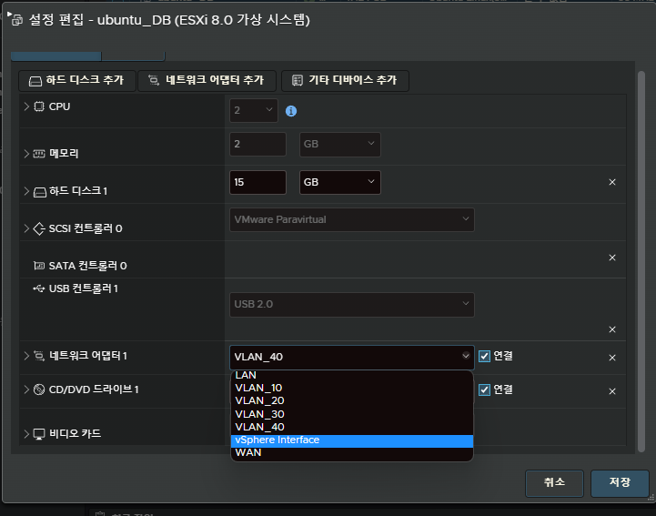
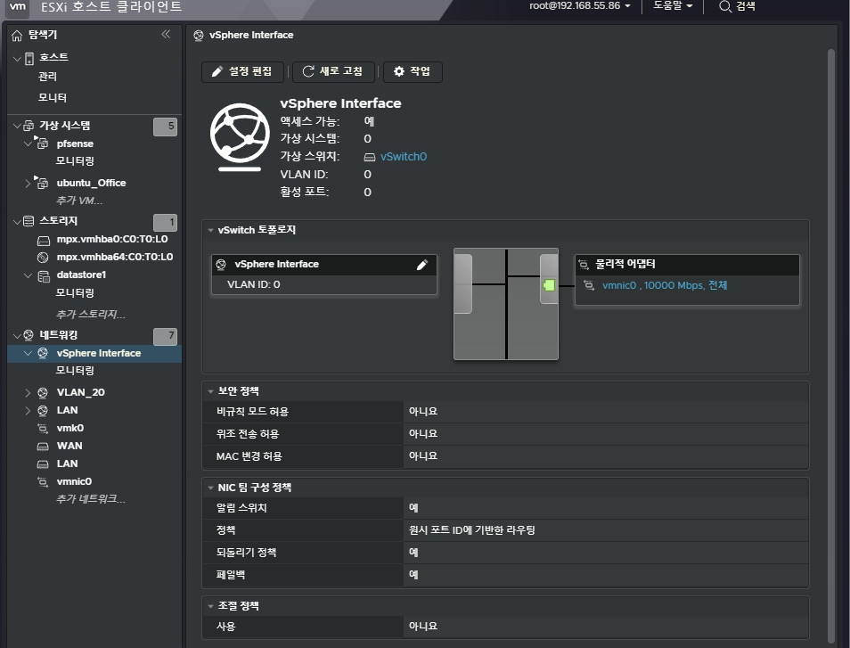
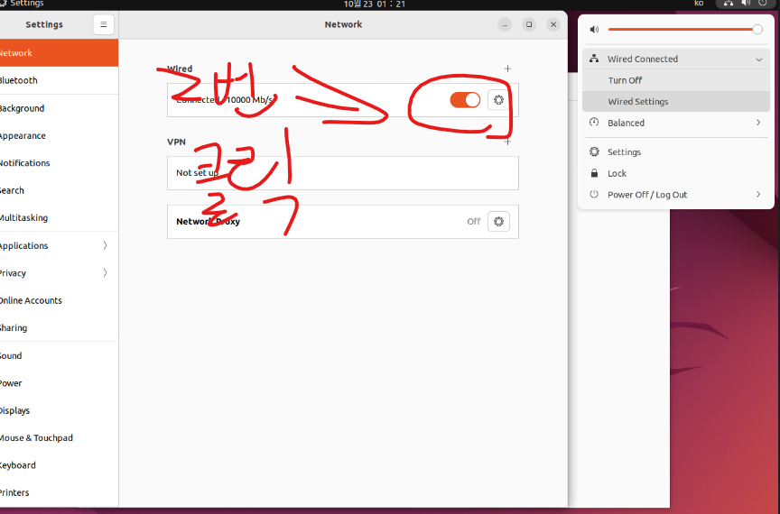
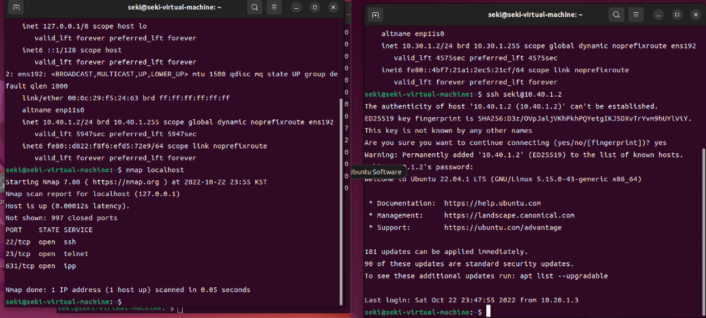

# 중요에러 
보통 EXSI로 VM을 깔면은 하나의 OS를 깔고 os.vmx라는 종류의 파일이 있는것을 복사해서 마이그레이션 마냥 그런식으로도 자주하는데  
이것떄문인지 원래 게이트웨이가 nic을 바꾸면 그러는지는 자세히는 모르겠지만 게이트웨이가 이상하게 설정되어있다.  
간단하게 말해서 게이트웨이가 이상하게 설정되서 다른 vlan으로 방화벽으로 막혀있지않아도 접속이 안된다.  
더 정확하게는 아에 그 아이피를 찾을수가 없다라고 보면 된다.  

# 원인 분석

보통 게이트웨이는 192.168.10.50이라는 ip를 사용할떄 192.168.10.1이라는 게이트웨이를 사용하여 다른 ip로 나갈떄나 다른 ip가 내 ip로 접근할떄 gateway를 사용하여 이동한다. 

즉 
```
192.168.10.50 -> 192.168.10.1 -> 192.168.3.1 -> 192.168.3.50 
```

게이트웨이 주소가 서브네팅 방식이나 보안 이런거에 따라 조금씩 다르게 설정할순 있지만 보통 이런식으로 다른 ip를 찾는것이다. 

하지만 지금 상황은

192.168.10.50 -> 0.0.0.0 -> ?  -> Unable to connect to remote host: No route to host


* `1줄요약`: gateway가 이상해서 다른 ip를 찾을수가 없다. 

# 해결법

간단하다. gateway만 고쳐주면은 된다.  
우리는 vm에서 gateway와 ping을 확인하기위해 net-tools를 깔것이다.   
하지만 우리는 인터넷에 지금은 접속이 불가능하다. lan의 스위치를 사용하기때문이다.   
lan도 인터넷에 접속이 가능하게 할것이지만 지금은 아니다.  
wan도 아직 사용이 가능하지않는 네트워크이다.   

# 준비

한번 꼬이거나 설정을 잘못하면은 vm을 다시 깔아야하는 번거로움이 있기에   
`반드시` 복잡한 작업을 할때는 `snapshot`을 찍어주자  
리눅스에서 timeshift로 백업도 가능은 하지만 용량도 많이 나가고   
snapshot으로 ESXI를 통쨰로 복구하는게 훨씬 빠르고, 직관적이고 좋다.  
물론 장시간 방치하고 snapshot을 쌓을수록 비정상적으로 용량이 늘어나기에 적절하게 snapshot을 폐기해 줘야한다.  
스냅샵을 지우지않고 놔둔다면은 어느순간 몇백기가 이상의 용량을 차지하기떄문이다.  

# 해결 시작 -1

우분투를 설치할 vm설정에 들어가고 NIC을 `HOST ONLY`로 변경  
따로 설정하지 않았다면은 vSpherer Interface이다.  



## 만약 저 이름이 없다면은 안될떄 

저게 없다면은 네트워크의 포트그룹에 들어가고  `vmnic0 , 10000 Mbps, 전체` 라는 pysical nic이 있는 포트 그룹의 이름을 nic으로 지정하자   
  
가끔 버그로 VM의 nic을 바꿔도 ip가 변경이 안된다. 정상작동도 안한다.  
해결법은 걍 os의 wifi같이 생긴거 껐다키면 해결된다  
참고로 nic설정은 vm을 껐다키지않아도 제대로 된다.    
이더넷 껏다 켜도 데탑이 정상적으로 굴러가는거와 노트북이 wifi 꺼져도 게임만 안하면 크게 일 안생기듯이 ㅇㅇ  



# 해결 시작 -2

ubuntu 터미널에 들어가서 

아래 명령어를 실행시켜주자

`-y`는 설치하시겠습니까? 명령어를 자동으로 yes로 해주는것이다.

``` bash
sudo apt -y update && sudo apt -y install net-tools 
```

그리고 

``` bash
route -n을 사용하여 게이트웨이를 확인하자.
```

정상적인 gateway는 다음과같이 설정된다.


그럼 비정상적인 네트워크를 확인하기위해 다시 vm설정을 눌러주자

그리고 아까와같이 wifi를 두번 누르자.

그리고 아래와 같이 명령어를 입력해준다


``` bash
route -n
```

``` bash
sudo ip route add default via 10.40.1.1 dev ens192
```

아래와같이 설정됐으면 잘된것이다. 

``` bash
route -n
```

다른 vlan으로 잘 접속되는지 확인하는건 간단하다

``` bash
ping -c 3 10.40.1.1
```

# 총 3번 더 하기

vlan이 4개 있다. 그 말은 이거 3번 더 해야된다는것이다.

아까를 보며 3번을 더 반복해준다.

# 결과

아까와같이 잘 해줫다면은 아래와같이 정상적으로 접속되는것을 확인할 수가 있다.

ping으로 한번 확인했으니 진짜로 접속해보자

## ssh 서버
``` bash
sudo apt -y install openssh-server
```
``` bash
sudo ufw allow 22/tcp
```

``` bash
sudo service ssh restart
```

## ssh client

``` bash
sudo apt -y install openssh-client
````


