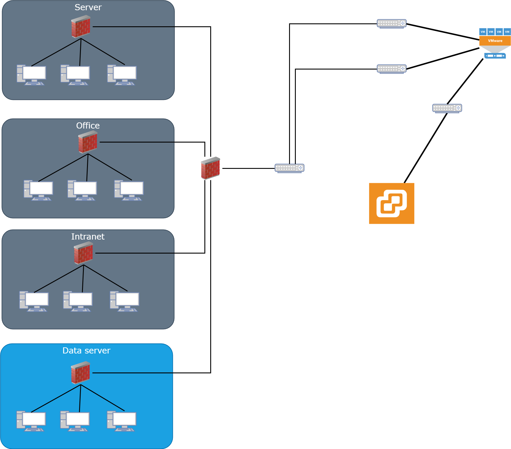
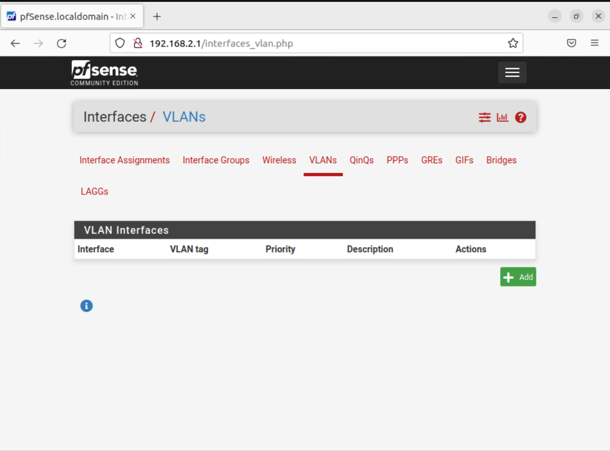
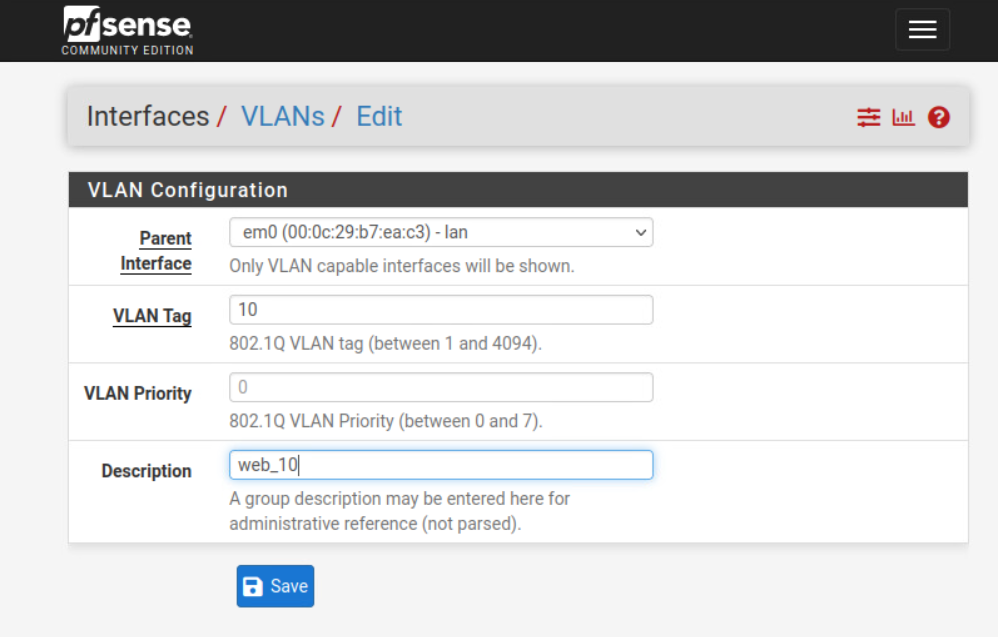
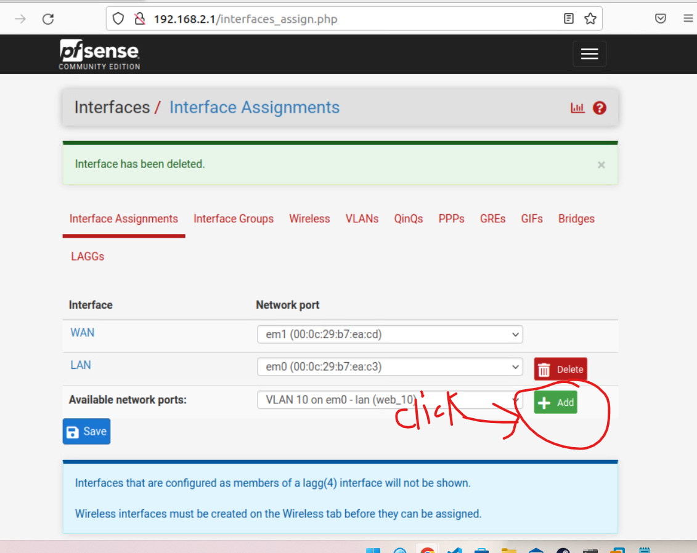
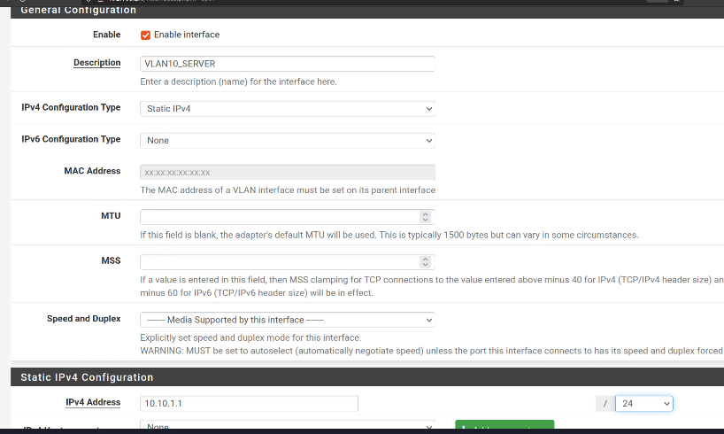
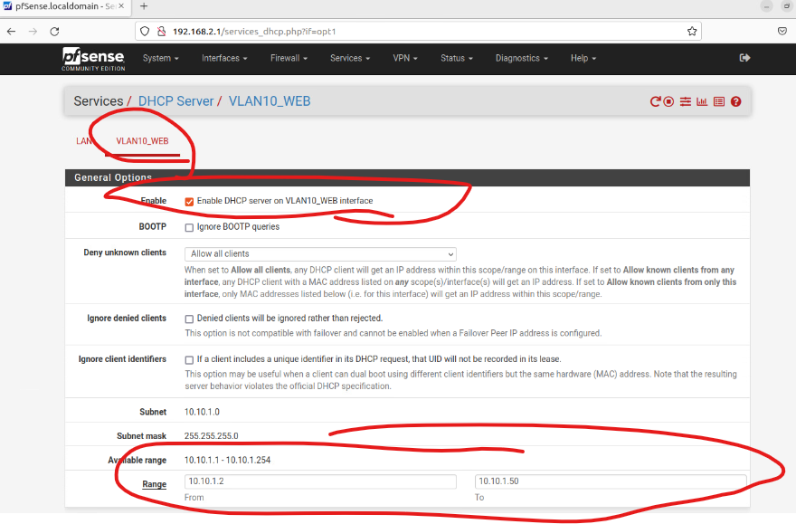
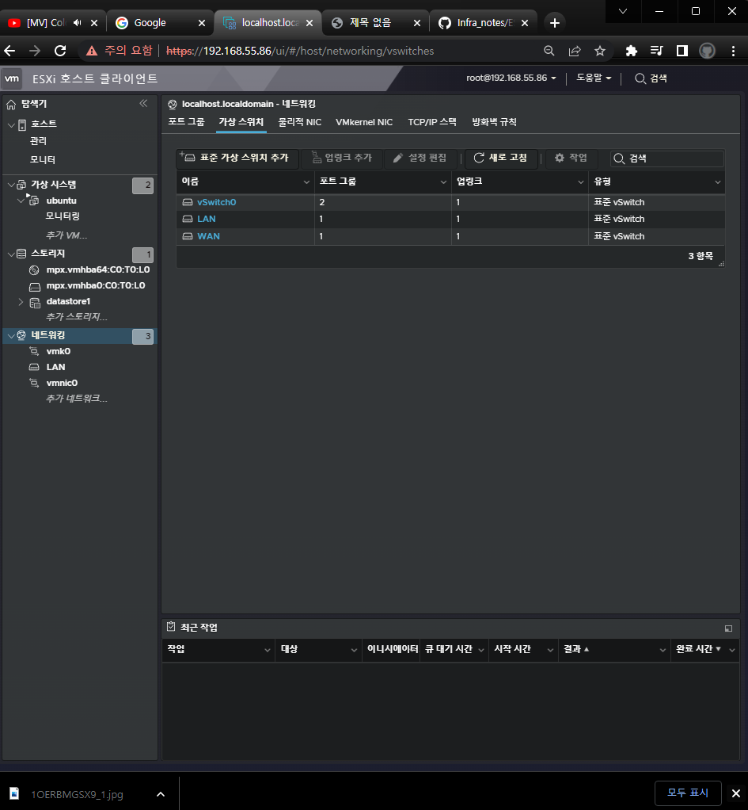
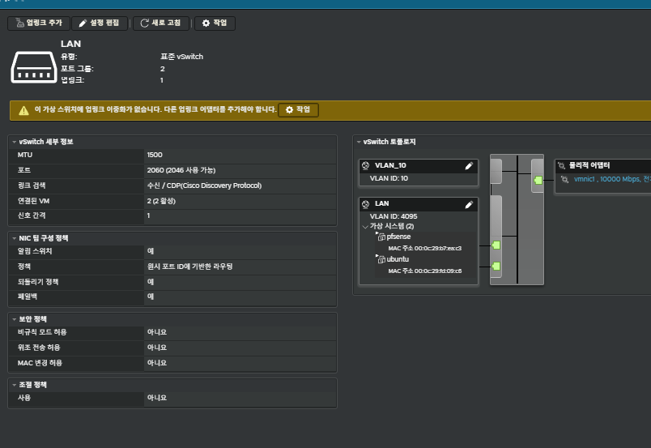
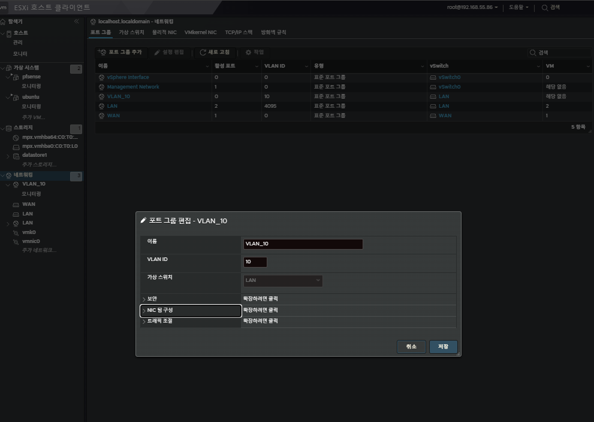

우리는 저번까지 pfsense의 기초적인 설치방법과 LAN을 연결한 우분투로 pfsense에 접근하는법을 배웠다.  
지금부터는 VLAN을 이용하여 망 분리를 할것이다. 간단하게 VLAN에 대해 설명하자면은   
L2계층에서 네트워크를 분할할수 있는데 이 분할한 네트워크들을 각각 사용할수있고  
이 패킷들은 하나이상의 라우터를 이동이 가능하게 할 수 있다. 망을 구성할때 복잡성을 줄이고 패킷의 흐름도 더 쉽게 파악할수 있게된다.  
그리고 VLAN은 4096 즉 2^12개의 아이디를 가질수 있는데 이것은 MAC주소 기반의 각각 VLAN을 구분하는 기준이된다.  
아래에서 사용하기전에 중요한 사항으로 VLAN 1과 4095가 있다.  
4095은 가상스위치, 외부스위치를 태깅할떄 사용된다.   
간단하게 그냥 lan에 vlan을 연결할때 lan에 vlan에 연결하기위해 부여하는 값이라 생각하면된다.  
자세한 내용을 여기를 확인하자.  
[vlan](https://docs.vmware.com/en/VMware-vSphere/7.0/com.vmware.vsphere.security.doc/GUID-3BB93F2C-3872-4F15-AEA9-90DEDB6EA145.html)

# 우리가 만들 네트워크의 구조 

# 시작 - 1

pfsense의 Interfaces -> VLANs 클릭 -> ADD 누르기

아래와 같이 만들어줌

Interfaces -> Interface Assignments 클릭 -> ADD 클릭

VLAN10_WEB 클릭후 아래와같이 설정 후 save 누르기

Service -> DHCP Server -> VLAN10_Server 클릭후 아래와같이 설정

ESXI 클라이언트 -> 네트워킹 -> 가상 스위치 -> LAN 클릭

LAN 연필 클릭 -> VLAN ID 4095(모두)로 변경 

포트 그룹 들어가기 -> 포트 그룹 추가 -> 아래와 같이 이름, VLAN ID 변경

분리한 망을 사용하기 위해 우분투 가상머신 추가 생성 -> 네트워크 어뎁터 VLAN_10으로 변경

`주의 하드디스크 용량은 10기가면 충분함`

비슷한 방법을 3번정도 더 할것이다. 

# Office 대역

1. Interface -> Assign -> VLANs
    * + 누르고 vlan 생성
    * parent interface `em0` 입력
    * VLAN tag 20
    * Description `office_20` 입력

2. Interface Assignments의 Available network prot에서 VLAN 30 on emo (office_20) 선택후 (+ADD) 클릭
    * OPT2 클릭
    * Enable Interface 체크
    * Description `VLAN20_OFFICE`로 변경
    * IPv4 Configuration Type은 Static IPv4로 변경
    * Static IPv4 Configuration에서 IPv4 Address를 '10.20.1.1' 로 변경하고 '/24'로 변경
3. Firewall:Rule 메뉴에서 vlan20_office 선택
    * 왼쪽 끝의 add 버튼 누르고 새 룰 생성
    * Protocol Any로 변경
    * Source는 `VLAN20_OFFICE net`으로 변경
    * save 누르고 appply cahnce 누름
4. Service -> DHCP Server로 이동한 후 `VLAN20_OFFICE`탭을 클릭
    * Enable DHCP server on VLAN10_WEB interface의 체크박스 클릭
    * Range를 `10.20.1.2` to `10.20.1.50`으로 설정
    * save 클릭
5. vSphere의 포트 그룹 이동 -> 포트 그룹 추가
    * 이름: VLAN_20으로 입력
    * VLAN ID 20입력
6. 가상 데스크탑 들어가서 ubuntu 생성 or 가져오기
    * Ubuntu NIC VLAN_20으로 변경

# Intranet 서버 대역

1. Interface -> Assign -> VLANs
    * + 누르고 vlan 생성
    * parent interface `em0` 입력
    * VLAN tag 30
    * Description `intranet_30` 입력

2. Interface Assignments의 Available network prot에서 VLAN 40 on emo (intranet_30) 선택후 (+ADD) 클릭
    * OPT3 클릭
    * Enable Interface 체크
    * Description `VLAN30_Intranet`로 변경
    * IPv4 Configuration Type은 Static IPv4로 변경
    * Static IPv4 Configuration에서 IPv4 Address를 '10.30.1.1' 로 변경하고 '/24'로 변경
3. Firewall:Rule 메뉴에서 vlan30_Intranet 선택
    * 왼쪽 끝의 add 버튼 누르고 새 룰 생성
    * Protocol Any로 변경
    * Source는 `VLAN30_Intranet`으로 변경
    * save 누르고 appply cahnce 누름
4. Service -> DHCP Server로 이동한 후 `VLAN30_Intranet`탭을 클릭
    * Enable DHCP server on VLAN30_Intranet interface의 체크박스 클릭
    * Range를 `10.30.1.2` to `10.30.1.50`으로 설정
    * save 클릭
5. vSphere의 포트 그룹 이동 -> 포트 그룹 추가
    * 이름: VLAN_30으로 입력
    * VLAN ID 30입력
6. 가상 데스크탑 들어가서 ubuntu 생성 or 가져오기
    * Ubuntu NIC VLAN_30으로 변경

# DB 서버 대역

1. Interface -> Assign -> VLANs
    * + 누르고 vlan 생성
    * parent interface `em0` 입력
    * VLAN tag 40
    * Description `DB_40` 입력

2. Interface Assignments의 Available network prot에서 VLAN 40 on emo (DB_40) 선택후 (+ADD) 클릭
    * OPT2 클릭
    * Enable Interface 체크
    * Description `VLAN20_OFFICE`로 변경
    * IPv4 Configuration Type은 Static IPv4로 변경
    * Static IPv4 Configuration에서 IPv4 Address를 '10.40.1.1' 로 변경하고 '/24'로 변경
3. Firewall:Rule 메뉴에서 vlan20_office 선택
    * 왼쪽 끝의 add 버튼 누르고 새 룰 생성
    * Protocol Any로 변경
    * Source는 `VLAN40_DB`으로 변경
    * save 누르고 appply cahnce 누름
4. Service -> DHCP Server로 이동한 후 `VLAN40_DB`탭을 클릭
    * Enable DHCP server on VLAN40_DB interface의 체크박스 클릭
    * Range를 `10.40.1.2` to `10.40.1.50`으로 설정
    * save 클릭
5. vSphere의 포트 그룹 이동 -> 포트 그룹 추가
    * 이름: VLAN_40으로 입력
    * VLAN ID 40입력
6. 가상 데스크탑 들어가서 ubuntu 생성 or 가져오기
    * Ubuntu NIC VLAN_40으로 변경

# 주의해야될 사항

vlan도 lan과 마찬가지로 인테넛에 정상접속이 가능해야된다.

이 목록들을 보고 무엇이 문제인지 추측해보길 바란다.

1. vlan이 생성되지 않았나?
    * esxi의 스위치와 포트를 확인하자

2. vlan이 만들어졌는데 연결이 되지 않는다?
    * dhcp서버를 확인해보자

3. vlan이 인터넷에 연결되지 않는가?
    * vmware의 nic 설정을 확인하자 

vSphere 접속용 wan - bridge auto
우리가 사용하는 wan - bridge auto
우리가 사용하는 lan - host only

