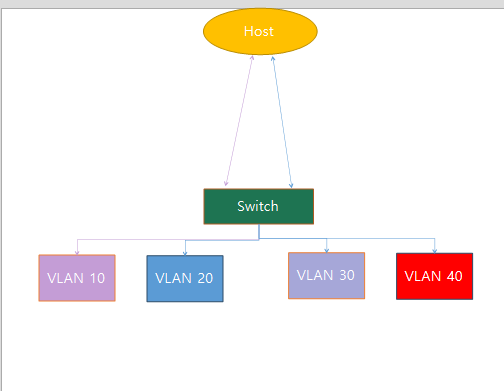

우리는 저번까지 pfsense의 기초적인 설치방법과 LAN을 연결한 우분투로 pfsense에 접근하는법을 배웠다.

지금부터는 VLAN을 이용하여 망 분리를 할것이다. 간단하게 VLAN에 대해 설명하자면은 

1. 원래는 스위치에 연결된 모든 장비는 브로드캐스트 도메인 안에 있는데 브로드캐스팅을 구분하고 서로 다른 브로드캐스팅끼리 소통하기위해 라우터가 필요함
2. 따라서 원래는 망을 여러개 만들면 고가의 장비를 대폭 요구함
3. VLAN은 하나의 스위치로 여러대의 분리된 스위치처럼 쓸수 있게 하고 하나의 포트로 전송 가능

# 우리가 만들 네트워크의 구조 

# 시작 - 1

pfsense의 Interfaces -> VLANs 클릭 -> ADD 누르기

아래와 같이 만들어줌

Interfaces -> Interface Assignments 클릭 -> ADD 클릭

VLAN10_WEB 클릭후 아래와같이 설정

ESXI 클라이언트 -> 네트워킹 -> 가상 스위치 -> LAN 클릭

LAN 연필 클릭 -> VLAN ID 4095(모두)로 변경 

포트 그룹 들어가기 -> 포트 그룹 추가 -> 아래와 같이 이름, VLAN ID 변경

분리한 망을 사용하기 위해 우분투 가상머신 추가 생성 -> 네트워크 어뎁터 VLAN_10으로 변경

`주의 하드디스크 용량은 10기가면 충분함`

비슷한 방법을 3번정도 더 할것이다. 

# Office 대역

1. Interface -> Assign -> VLANs
    * + 누르고 vlan 생성
    * parent interface `em0` 입력
    * VLAN tag 20
    * Description `office_20` 입력

2. Interface Assignments의 Available network prot에서 VLAN 30 on emo (office_20) 선택후 (+ADD) 클릭
    * OPT2 클릭
    * Enable Interface 체크
    * Description `VLAN20_OFFICE`로 변경
    * IPv4 Configuration Type은 Static IPv4로 변경
    * Static IPv4 Configuration에서 IPv4 Address를 '10.20.1.1' 로 변경하고 '/24'로 변경
3. Firewall:Rule 메뉴에서 vlan20_office 선택
    * 왼쪽 끝의 add 버튼 누르고 새 룰 생성
    * Protocol Any로 변경
    * Source는 `VLAN20_OFFICE net`으로 변경
    * save 누르고 appply cahnce 누름
4. Service -> DHCP Server로 이동한 후 `VLAN20_OFFICE`탭을 클릭
    * Enable DHCP server on VLAN10_WEB interface의 체크박스 클릭
    * Range를 `10.20.1.2` to `10.20.1.50`으로 설정
    * save 클릭
5. vSphere의 포트 그룹 이동 -> 포트 그룹 추가
    * 이름: VLAN_20으로 입력
    * VLAN ID 20입력
6. 가상 데스크탑 들어가서 ubuntu 생성 or 가져오기
    * Ubuntu NIC VLAN_20으로 변경

# Intranet 서버 대역

1. Interface -> Assign -> VLANs
    * + 누르고 vlan 생성
    * parent interface `em0` 입력
    * VLAN tag 30
    * Description `intranet_30` 입력

2. Interface Assignments의 Available network prot에서 VLAN 40 on emo (office_40) 선택후 (+ADD) 클릭
    * OPT4 클릭
    * Enable Interface 체크
    * Description `VLAN40_DB`로 변경
    * IPv4 Configuration Type은 Static IPv4로 변경
    * Static IPv4 Configuration에서 IPv4 Address를 '10.40.1.1' 로 변경하고 '/24'로 변경
3. Firewall:Rule 메뉴에서 vlan40_Intranet 선택
    * 왼쪽 끝의 add 버튼 누르고 새 룰 생성
    * Protocol Any로 변경
    * Source는 `VLAN40_DB`으로 변경
    * save 누르고 appply cahnce 누름
4. Service -> DHCP Server로 이동한 후 `VLAN40_DB`탭을 클릭
    * Enable DHCP server on VLAN10_WEB interface의 체크박스 클릭
    * Range를 `10.40.1.2` to `10.40.1.50`으로 설정
    * save 클릭
5. vSphere의 포트 그룹 이동 -> 포트 그룹 추가
    * 이름: VLAN_40으로 입력
    * VLAN ID 40입력
6. 가상 데스크탑 들어가서 ubuntu 생성 or 가져오기
    * Ubuntu NIC VLAN_40으로 변경

# DB 서버 대역

1. Interface -> Assign -> VLANs
    * + 누르고 vlan 생성
    * parent interface `em0` 입력
    * VLAN tag 40
    * Description `DB_40` 입력

2. Interface Assignments의 Available network prot에서 VLAN 40 on emo (DB_40) 선택후 (+ADD) 클릭
    * OPT2 클릭
    * Enable Interface 체크
    * Description `VLAN20_OFFICE`로 변경
    * IPv4 Configuration Type은 Static IPv4로 변경
    * Static IPv4 Configuration에서 IPv4 Address를 '10.20.1.1' 로 변경하고 '/24'로 변경
3. Firewall:Rule 메뉴에서 vlan20_office 선택
    * 왼쪽 끝의 add 버튼 누르고 새 룰 생성
    * Protocol Any로 변경
    * Source는 `VLAN20_OFFICE net`으로 변경
    * save 누르고 appply cahnce 누름
4. Service -> DHCP Server로 이동한 후 `VLAN20_OFFICE`탭을 클릭
    * Enable DHCP server on VLAN10_WEB interface의 체크박스 클릭
    * Range를 `10.20.1.2` to `10.20.1.50`으로 설정
    * save 클릭
5. vSphere의 포트 그룹 이동 -> 포트 그룹 추가
    * 이름: VLAN_20으로 입력
    * VLAN ID 20입력
6. 가상 데스크탑 들어가서 ubuntu 생성 or 가져오기
    * Ubuntu NIC VLAN_20으로 변경
