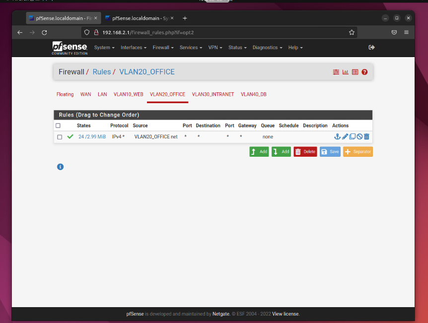
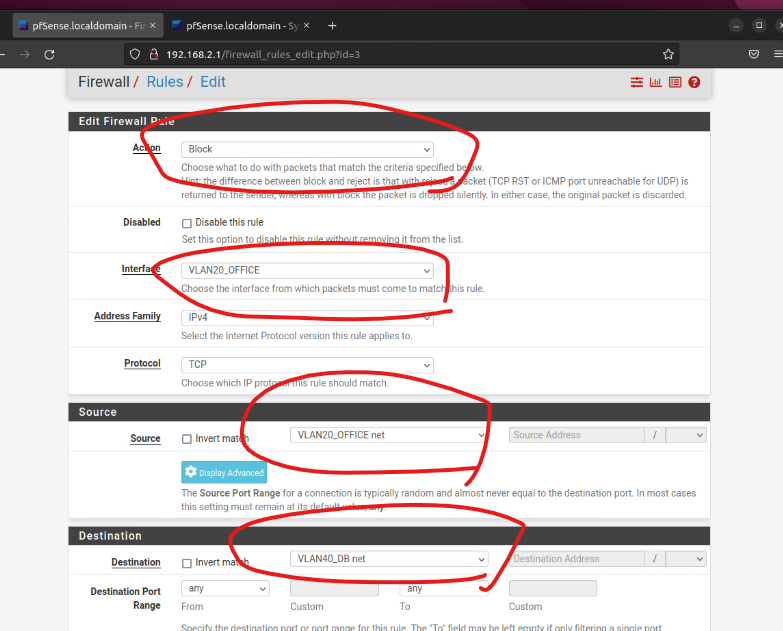
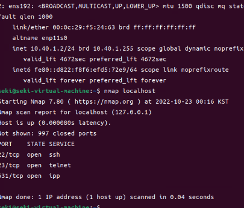
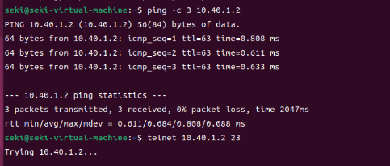
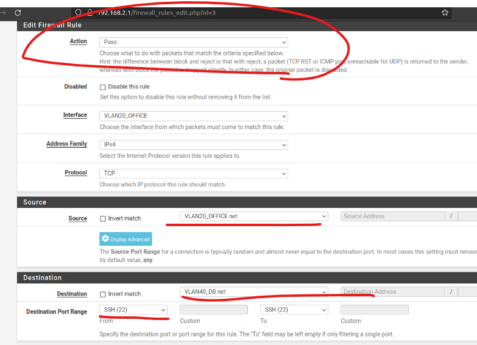
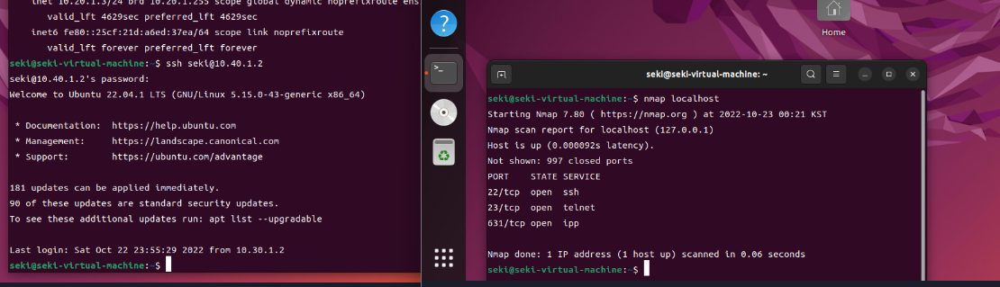

이번부터는 보안의 꽃인 ACL(Acess Control List) 설정 즉 접근제어를 할 것이다.

# 방화벽 설정 - 1 모든포트 차단  

pfsense의 Firewall -> Rule -> VLAN20_OFFICE 에 들어가기

맨 왼쪽 ADD 클릭

아래와 같이 작성

VLAN20이 VLAN 40으로 갈수있는 모든 포트를 차단하는 룰이다.

## 테스트 -1

ping을 보면은 정상 작동을 하지만 

pfsense에 의해서 모든 포트의 접근권한이 막혔기에 아래와같이 telnet을 사용할 수가 없다. 

# 방화벽 설정 - 2 특정포트 열기

22번(ssh) 포트만 열어보는 작업을 해볼거다.

아까와같이 ADD(맨 왼쪽) 클릭한다.

들어가서 아래와같이 세팅해주면 된다. 

## 테스트 -2 

정상작동된다

