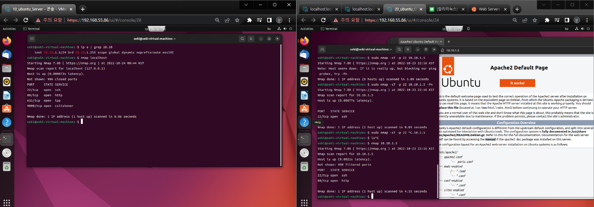

본격적으로 방화벽 정책을 설정하는법을 할것이다.
실제 서비스와 유사하게 해볼것이다. 

들어가기에 앞서서 우리는 전까지 VLAN으로 환경을 구축했는데

1. VLAN10 - Server
2. VLAN20 - Office
3. VLAN30 - Intranet
4. VLAN40 - DB

이런식으로 구성했으니 환경을 구분하길 바란다.

운영체제는 윈도우를 깔아도 되고 우분투 칼리 다 되는데 우분투, 윈도우, centos외에는 추천하진 않는다.

가상머신을 ESXI에서 깔기보단 VMWARE에서 깐 다음에 vmx로 변환한다음 esxi 스토리지에 올리는식으로 까는게 좀 더 편하다.

물론 pfsense같은 네트워크 설정이 복잡한것은 esxi에서 깔아주길바란다. 
기본 설정이 정확해도 콘솔로 조율하거나 해야 완벽하게 되는데 난이도도 높고 잘 안되고 꼬일 확률도 높다.

# firewall 구축  - 1 Ubuntu Server setting 

도커, 쿠버네티스로도 설정할수있지만 network 설정이 조금 복잡하기에 그것은 나중으로 미루고

가장 간단한 apache-2를 설정할것이다.

VM은 UBUNTU_SERVER로 할 것이다. NIC은 

``` bash
sudo apt -y update && sudo apt -y install apache-2
```

다운받았으면은 아래 명령어를 눌러준다. firefox에 들어가서 localhost를 쳐도되지만

이렇게하는게 개발자 감성이니 익혀두자

``` bash
firefox localhost
```

그러면 아래와같이 뜰 것이다. 성공이다. 


# firewall 구축  - 2 Pfsense Aliases Rule

챕터 5에서 설정한 rule을 먼저 지워주자


Firewall Aliases -> Add 

그리고 아래와같이 설정해주자


RFC1918은 일종의 규약인데 여기에 정리해놨다 -> [RFC1918](./RFC1918.md)

이렇게 만드는 이유는 단순하다. ip 범위를 규정하고 효율적으로 관리하기 위해서이다.

# firewall 구축 -> 3 VLAN Rule setting

Firewall Rule -> VLAN10_WEB -> ADD 맨 왼쪽 -> 아래와 같이 변경 -> Save - > Apply Change

Alias의 규칙과 아래 다른 규칙들에 의거하여 다른 접속을 막는것이다. 


하지만 이러면 문제가 생긴다.` VLAN10끼리의 통신도 막아`버리기에 VLAN10끼리는 통신이 되게 해줄것이다.

아래와 같이 설정해주면은 같은 VLAN10을 사용하는 VM끼리는 통신이 가능하게된다.


이것또한 다른 3개의 VLAN에 똑같이 반복하여 설정해준다.

ssh서버를 이용하여 아래 로그를 생성해봤다. 


# firewall 구축 -> 4 VLAN Rule port open

아에 다른 vlan끼리의 접속을 막아버리면은 보안상 좋지만 비지니스적으로 힘들어진다.

그래서 특정포트를 열거나 해야되는데 우리는 이것을 할 것이다. 

Firewall Rule -> VLAN20_OFFICE -> ADD 맨 왼쪽

ACTION `PASS` - > Protocol `TCP` -> Source `VLAN_OFFICE net` -> Des `VLAN10_WEB net`

-> Destination Port Range `SSH 22` -> SAVE -> Apply Chnage

아래와 같이 설정을 해준다.


그리고 아래와 같이 카피를 눌러준다. 다른 포트도 접근할수있게 해줄것이다.


-> Destination Port Range `HTTP 80` -> SAVE -> Apply Chnage


이것을 또 반복해준다. HTTPS도 활성화 시켜줄것이다.

-> Destination Port Range `HTTP 443` -> SAVE -> Apply Chnage

정상적으로 설정했다면은 

UBUNTU_OFFICE`(VLAN20)` -> UBUNTU_SERVER`(VLAN10)` 

22, 80, 443 포트로의 접속이 잘 될것이다.


