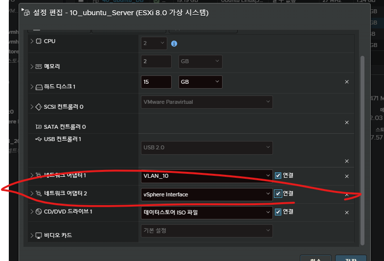

# ubuntu package download 서버 접속방법



# 서버 만들기
ssh 서버 만들기(접속하게 만들기위한 서버)

``` bash
sudo apt -y update && sudo apt -y install openssh-server
```

# 클라이언트
ssh client 만들기(접속하기위한 툴)

``` bash
sido apt -y update && sudo apt -y install openssh-client
```


# 접속방법

접속 방법

ssh (user)@(server ip)
``` bash
ssh seki@10.10.1.5
```