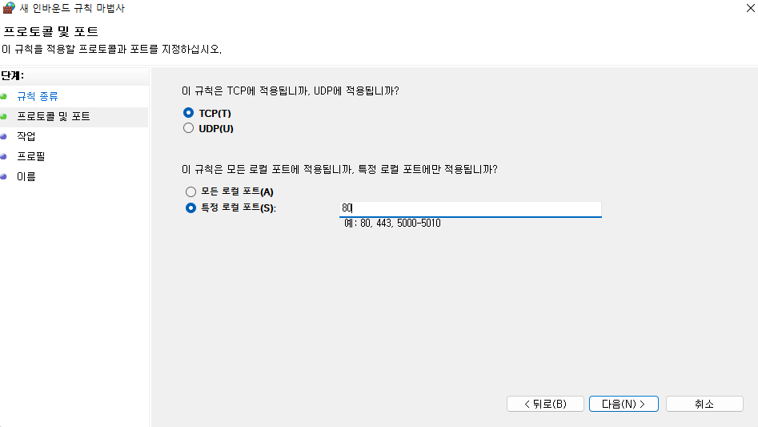

# DMZ (demilitarized zone)

이제부터는 DMZ ZONE을 만들어볼것입니다. 

간단하게 `서비스를 하는데 사용하는 외부로 노출시킨 구역`이다.

만드는 이유는 서비스를 제공하기 위해서인데 보통 우리가 웹해킹 하면 생각나는 그것이 

DMZ ZONE에 노출시킨 웹사이트의 취약점을 찾는 행위라고도 할 수가 있다.

# 포트 포워딩 시키기

# 모뎀이란?

모뎀이란? L1계층에서 쓰는 장비로 통신사가 쏴주는 공인 IP를 받고 내부에서 쓰는 데이터들을 공인 IP로 내보내는 역할이다. 
공인IP기에 잘못유출하면 위험하다. 물론 일반적인 가정에선 유출되도 별 문제 없지만  
하지만 우리는 직접 외부로 노출시키고 포트를 활성화 하는 작업을 하기에 위험합니다.  그렇기에 반드시 주의하길 바란다.
일단 이 작업을 수행할려면 기본적으로 모뎀과 라우터가 어디있는지 알고있어야한다.  
모뎀은 보통 신발장같은곳을 찾아보면 누전기 근처에 위치해있고 라우터는 TV근처에 존재한다.  

라우터의 접속은 일단은 모두 가능하다는 가정하에 진행할것이다.

# 시작 

  

여기에서 gateway가 보이는데 이 gateway를 웹브라우저의 url을 gateway ip로 입력해준다.  
그러면 아래와 같이 라우터를 관리하는 브라우저가 뜰 것이다.  

여기서 아래와같이 dmz존을 활성화 해준다. iptime도 같은 성격이고 레퍼런스가 많기에 충분히 할수있을것이다.  
참고로 나는 머큐리 router가 안잡히고 바로 mordem으로 연결되기에 bridge로 변경하느라 좀 고생했다.  어려운건 아니지만...

그 다음 lan으로만 접근이 가능한 webserver을 pfsense라는 라우터의 nat이라는 기능을 통하여 외부로 연결하는 기능이다.  
정확하게는 우리는 DNAT이라는 기술을 사용하여 VLAN의 특정 포트를 WAN으로 내보내는것이다. SNAT이란 기술도 있지만 여기서 설명하기엔 너무 길어지기에 

링크 [NAT]()

위와같이 설정해주자.  매우 간단하다. 

그리고 딱 한가지만 하면되는데 윈도우 방화벽의 특정 inbound만 허용하면된다.  
window는 특정 프로그램을 깔지않는 이상 all deny정책을 고수하기에 inbound를 허용해야된다.  

아래와같이 해주자

마즈막은 넣고싶은 rule의 명칭을 넣으면 된다.

그러면 완료된다.