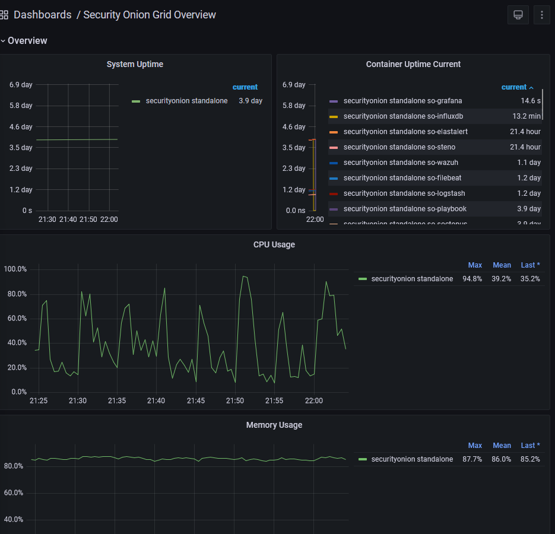

# Grafana란?
Grafana는 보통 각 노드들의 상태를 모니터링하기위해 사용합니다.  
Logstash를 사용하여 각 자원들의 상태정보를 가져와서 Grafana에 가져와서 다양한 클러스터에 대한 정보, 하드웨어의 장애, 공격감지, 트래픽감지, APT공격 등을  
효과적으로 한눈에 모니터링하기 쉽게 응집시켜주고 시각화 하기 매우쉬운 강력한 장점이 있습니다.  
하지만 아직은 다른 노드들을 통합적으로 다루는 모니터링 기법은 다루지않을것이도 13_Advanced에서 다룰껍니다.



id: admin
passwd(명령어로 확인해야됨): 0qihlnkw1gkoyHfQnt3Q

``` bash
[root@securityonion dodo]# sudo salt-call pillar.get secrets
local:
    ----------
    fleet:
        MYn9AiByU7jYpmHgMjmW
    fleet_enroll-secret:
        WhHmhpBBkNijPYmoLgb5GLXs3PYl8JFl
    fleet_jwt:
        lyKmMzkq0ViCKPIQUdjQ
    fleet_sa_email:
        service.account@securityonion.invalid
    fleet_sa_password:
        0qihlnkw1gkoyHfQnt3Q
    grafana_admin:
        xpkZ68PbCOTECf3Yz7ci
    mysql:
        hTPLCRf183vVvnwFcHDY
    playbook_admin:
        FnSs2YGfgJ7EDo3U4N1f
    playbook_automation:
        aMqw7zfBMdTGa7kxl6Fe
    playbook_db:
        FU20yzVN0JUMogc1FfpA
```
로그인은 ELK와는 조금 다른 특이한 방식으로 로그인합니다.  
물론 로그인을 안해도 모니터링 자체는 가능하나 위 사진과같은 다른 대시보드를 수정하는 등 작업은 불가능합니다.  
다른 세팅방법은 아래 공식사이트에 나와있습니다만 grafana공식문서를 보는것을 추천해요.  


[Grafana](https://docs.securityonion.net/en/2.3/grafana.html)