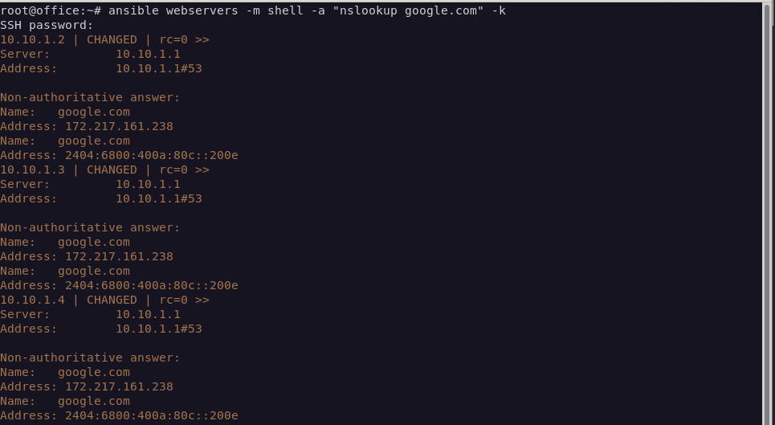

# 자동화 
우리는 지금까지 서버를 주구장창 만들고, router의 보안정책만 만들기만 했다. 하지만 가장 중요한건 이런 수많은 서버들을 
통합적으로 보안점검을 하고 업데이트를 해야하는 시스템이 있어야 안정적이면서 효율적인 서버운영이 가능하다.  
이러한 솔루션을 가능하게 해주는 도구로 대표적으로 ansible이라는 도구가 있다.  


## 잡소리
이러한 솔루션은 해커도 유용하게 사용하고있으며 이러한 기법을 활용한 대표적인 공격기법은 DDOS인데 하면은 범죄이니 절대로 하지말자.  
그리고 물론 chef나 superputty도 있으며 다양한 솔루션이 있는데 그중 가장 현대에 들어서 핫하며 최신 솔루션이 ansible이다.  
chef는 솔직히 안써봐서 뭐라 못하겠고 superputty는 소규모 서버를 대략 10개이하로 제어할떄 나름 괜찮지만 ansible처럼 통합적인 성공 실패여부를  관리가 어렵다는 단점이 있다.  
salt는 최근에 써볼려고 했으나 하나하나 salt mini였나를 클라에 깔아야되서 아직 내 수준에선 ansible이 더 좋아보인다.

# ansible 설치

설치자체는 매우 간단하다

``` bash
sudo apt -y update &&\
apt -y install ansible
```

``` bash
vim /etc/ansible/hosts
```
> /etc/ansible/hosts

``` bash
[webservers]  
10.10.1.2 ansible_user=server  
10.10.1.3 ansible_user=server  
10.10.1.4 ansible_user=server  

[ftp]
10.10.1.2 ansible_user=server

[db]
10.40.1.2 ansible_user=server

[office]
10.30.1.2 ansible_user=server
```
공개키 교환을 안하면은 에러가 뜰텐데 일단은 숫자가 적으니까  
각각 ssh로 접속하여 공개키 교환을 수동으로 하고 해주면된다.  

``` bash
ansible webservers -m ping -k
```

그리고 아래처럼 입력해주면은 기본세팅은 끝이다.

``` bash
ansible webservers -m "nslookup google.com" -k
```

# 하지만
이러한 방법은 호스트의 숫자가 많을수록 비효율적이다.   
이것또한 자동화할것이다. 인터넷에는 ansible-playground를 사용하여 공개키를 이상하게 교환하는데 이건 복잡하기만 하고 비효율적이니 비추다.  
ssh를 설치하면 있는 `ssh-keyscan`을 이용한 방법을 사용할것이다.  
호스트 ip만을 출력해주는 스크립트다. 아래와 같이 해주자  

``` bash
ansible all -m ping --list-hosts | grep -v hosts | awk '{print $1}' > host_list
```

주의할점은 ansible에 등록하지 않는 호스트를 사용할경우 >>를 사용하여 append 모드를 사용하자.  
이거는 overwrite라서 이전 `known_hosts`는 사라진다.
``` bash
ssh-keyscan -f host_list > ~/.ssh/known_hosts
```


# 비밀번호
상식적인 이야기지만 ssh는 공개키를 교환하면은 비밀번호를 입력하지않아도 ssh로 다른유저에게 접속이 가능하다.  
대표적 기능은 `ssh-copy-id` 기능을 이용한 공개키 교환이다.

이 공캐키를 배포하는 ansible-playgorund를 만들어보자

``` bash
ssh-keygen -t rsa 
```
[ssh](./rule/ssh_publicKey_change.yml)

위 ansible-playground를 실행할려면 아래와같이 사용해주자  
``` bash
ansible-playbook ssh_publicKey_change -k
```

이러면 모든 서버에 rsa로 암호화된 공개키를 /home/{{ ansible_user }}/.ssh/authorized_keys 로 전송이 된다.  

이러한 옵션들을 더 자세히 공부하고싶다면은  [ansible_doc](https://docs.ansible.com/ansible/latest/inventory_guide/connection_details.html)
여기를 참고하여 yml을 작성해보자


# 기본적인 보안툴 설치
기본적으로 리눅스에는 iptables 라는 커널에 탑재된 netfilters라는 기능을 서포트 해주는 툴이 설치되어있다.  
하지만 우리는 ufw라는 데비안 계열에서 만든 iptables를 좀더 쉽게 다룰수있게 만든 기능을 사용할것이다.  
기본적으로 ufw는 all deny정책을 수행하기에 잘못 포트를 닫는순간 대참사가 발생하니 주의해서 rule을 작성하고 관리해야한다.

# 보안툴 시작

아래 코드는 [apt-basic-secure](./rule/apt-basic-secure.yml)  
링크의 playbook을 활용하여 간단한 스크립트를 실행시키는 코드이다.  
대충봐도 알겠지만 apt update, apt install ufw, apt install libpam-pwquality 를 실행하는 코드이다.  
만약 이러한 것을 특정 호스트에게만 사용하고 싶다면은  
hosts를 webservers나 dbservers 와 같이 특정서버로 바꾼다음에 실행해주면 된다.  


``` bash
ansible-playground apt-basic-secure.yml -b -K 
```

# ufw 활성화 및 룰 추가

[ufw_basic](./rule/ufw.yml)  

위 소스코드를 만들어서 아래와같이 실행하면 위 룰처럼 실행될것이다.

``` bash
ansible-playground ufw_rule.yml -b -K
```
