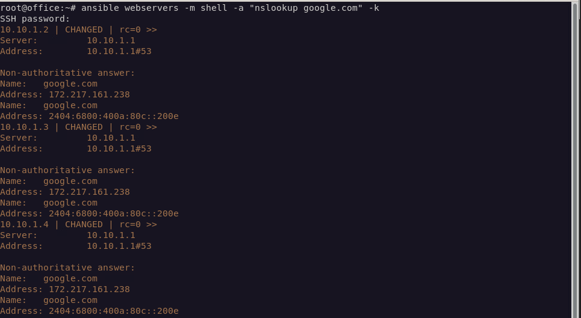

# 자동화 
우리는 지금까지 서버를 주구장창 만들고, 보안정책만 만들기만 했다. 하지만 가장 중요한건 이런 수많은 서버들을 
통합적으로 보안점검을 하고 업데이트를 해야하는 시스템이 있어야 안정적이면서 효율적인 서버운영이 가능하다.  
이러한 솔루션을 가능하게 해주는 도구로 대표적으로 ansible이라는 도구가 있다.  

이러한 솔루션은 해커도 유용하게 사용하고있으며 이러한 기법을 활용한 대표적인 공격기법은 DDOS인데 하면은 범죄이니 절대로 하지말자.  

# 우리가 할것

FTP 서버에 보안점검 도구를 올리고 각 서버에서 ftp 서버에 배포된 파일을 가져오고 보안점검을 수행하는것을 시행할것이다.  

# ansible 설치

설치자체는 매우 간단하다

``` bash
sudo apt -y update &&\
apt -y install ansible
```

``` bash
vim /etc/ansible/hosts
```
> /etc/ansible/hosts

[webservers]  
10.10.1.2 ansible_user=server  
10.10.1.3 ansible_user=server  
10.10.1.4 ansible_user=server  

공개키 교환을 안하면은 에러가 뜰텐데 일단은 숫자가 적으니까  
각각 ssh로 접속하여 공개키 교환을 수동으로 하고 해주면된다.  

``` bash
ansible webservers -m ping -k
```

그리고 아래처럼 입력해주면은 기본세팅은 끝이다.

``` bash
ansible webservers -m "nslookup google.com" -k
```